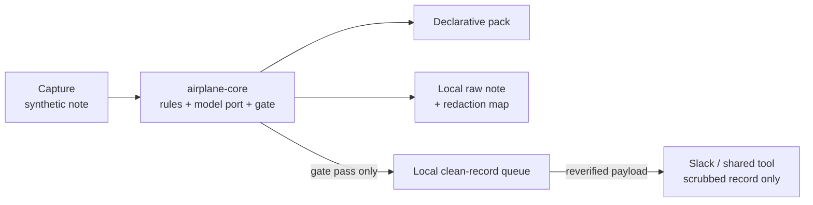

# Reference Architecture: Scrub, Gate, Clean Egress

Airplane Mode is a reference architecture for moving a sensitive workflow to the
edge. It is written first for adopters who need a safer operating pattern, and
second for builders who want to extend the inference runtime.

## 1. End-User View

The job is simple:

```text
capture a synthetic note -> scrub identifiers locally -> verify -> send only a clean record
```

Use this pattern when a team already moves sensitive text through shared tools:
Slack, spreadsheets, intake queues, referral trackers, or EHR-adjacent handoffs.
The reference workflow gives them a safer first move:

1. keep the raw note on the local edge;
2. scrub names, IDs, dates, and context-specific identifiers;
3. re-scan the exact outbound payload;
4. block by default if any residual identifier remains;
5. send only the scrubbed record to the shared destination.

This repo does not claim to be a medical device, a HIPAA compliance product, or
the final iPhone hardware proof. It is a production-shaped starter for learning
where the boundary belongs and how to test it.

## 2. Adoption Unit

The unit of adoption is the workflow pack, not a fork of the core.

```text
packs/my-workflow/
  recognizers/   local identifier formats
  schema.yaml    clean record shape
  policy.yaml    recall threshold and escalation boundary
  sink.yaml      clean-record destination
  eval/          synthetic notes and expected labels
```

An adopter changes the pack to match their workflow. They do not change the
verifier, raw-note handling, or egress rule.

## 3. System Shape



The gate is the architectural center. No path reaches the sink without passing
through it.

## 4. Builder View

Builders extend the ports, not the trust rule:

| Port | Current path | Next path |
| --- | --- | --- |
| `InferenceProvider` | `llama-server` over local HTTP; Swift `TextInferenceProviding` mock | real `mlx-swift` text adapter |
| `Capture` | phone browser / CLI arg | native ASR or text capture |
| `SecureStore` | simulator memory / local file | Keychain / Secure Enclave boundary |
| `Sink` | Slack webhook or bot token | additional clean-record sinks |

The iOS package currently includes simulator mocks for two backend modes:

- `MLX Swift mock`
- `Edge HTTP mock`
- `On-device MLX Swift` visible as a locked hardware-gated target

Both runnable modes return the shared scrub response contract in `docs/contracts/`.
The `MLX Swift mock` first emits raw JSON spans through `TextInferenceProviding`,
then the simulator scrub backend applies redactions and gates the result. That
keeps the UI and tests interoperable while leaving the real `mlx-swift` text path
open for a measured implementation. The locked target is intentional: it names
the gap without letting Simulator imply a privacy or performance proof.

## 5. Evidence Checklist

Before presenting this architecture as working for a new workflow, collect this
evidence:

| Claim | Evidence |
| --- | --- |
| Pack is safe to share | `./run.sh gates-fast` includes pack-blindness |
| Scrub catches expected identifiers | `PACK=packs/my-pack ./run.sh eval` |
| Outbound payload is gated | web tests and Slack smoke path |
| iOS selector is wired | `./run.sh ios-sim` |
| Real iPhone text inference works | not yet proven; requires M3-T00 device measurement |

The last row is intentionally not green. Naming it keeps the adopter safe and
gives builders a useful contribution target.

## 6. Why This Fits The CNCF Pattern

For end users, this behaves like a journey report and reference architecture:
here is the problem, boundary, runbook, and adaptation path.

For builders, it behaves like a clean extension point: the model is a port, the
contract is fixture-tested, and the runtime gap is specific enough to close.

One artifact serves both audiences because it separates outcome language from
mechanism language while keeping one shared truth boundary.
