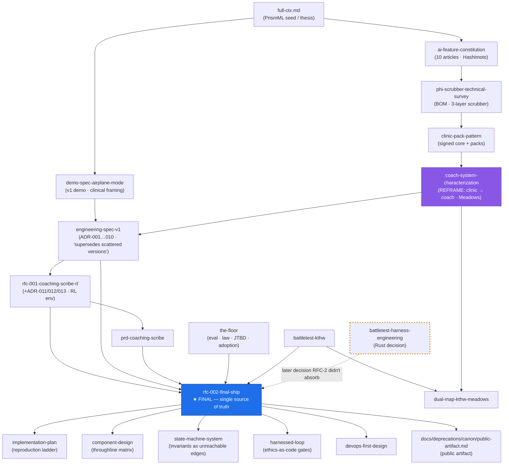
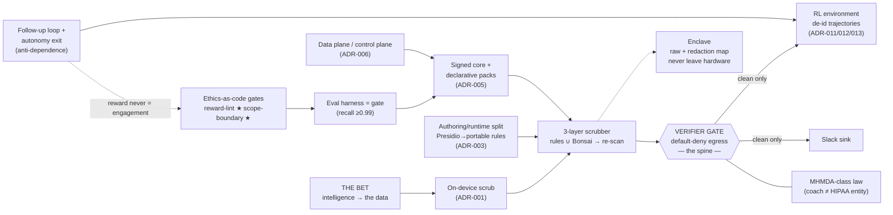

# CANON — Airplane Mode (on-device PHI scrubber demo)

*A map of the design corpus in `files/`: what each doc is, how they supersede each other, the concepts they share, and where they contradict. This repo holds no code yet — it is a design canon. This file is the index over it.*

**Single source of truth for building:** `files/rfc-002-final-ship.md` (Status: Final / Accepted). Everything else is either upstream of it (folded in) or a lens onto it. When a conflict below is unresolved, RFC-002 wins **unless noted otherwise** — three drift items below are cases where a *later* doc supersedes RFC-002 and RFC-002 never caught up.

---

## 1. The seed and the goal

- **Seed:** `full-ctx.md` — a research conversation about **PrismML**, the Caltech 1-bit "Bonsai" LLM company, and the investor thesis behind it (Khosla: *"intelligence per unit of energy and cost,"* not datacenter scale).
- **Goal:** make that bet *watchable*. **"Airplane Mode"** — a mental-health **coaching scribe** that runs Bonsai 1.7B entirely on a 2019 iPhone 11, de-identifies the session **on-device**, posts only a clean structured record to Slack, generates a client-paced follow-up, and grows a de-identified RL environment — with every ethical/legal rule enforced as an automated gate. The thesis is **"the data never leaves,"** and the value is **the loop**, not the note.

> **Build status (2026-06-25):** the repo is now *seeded* for loop-engineering. The architecture is decided (ADR-014: portable Rust core + ports). The build runs as a harnessed loop — see **`AGENTS.md`** (operating manual) and **`backlog/`** (M0–M5 work queue). Bonsai ecosystem facts are scoped in **`docs/seed/bonsai-ecosystem-brief.md`**. No code is written yet; M0 (the golden-note truth set) is the first task.

---

## 2. Supersession & dependency graph

---

## 3. Document registry

| Doc | Layer | Role | Status |
|---|---|---|---|
| `full-ctx.md` | Seed | PrismML/Bonsai research; the investor bet | Reference |
| `ai-feature-constitution.md` | Foundation | 10 articles (Hashimoto) + AI-or-not routing tree | Live (principles) |
| `phi-scrubber-technical-survey.md` | Foundation | De-id BOM; 3-layer scrubber; Philter/Presidio | Live, **stale on framing** (clinical/Cityblock) |
| `clinic-pack-pattern.md` | Foundation | Signed core + declarative packs | Live, **stale on format (HCL) + pack name** |
| `coach-system-characterization.md` | Foundation | **Reframe** clinic→coach; Meadows 12 points; rejected-options log | Live |
| `demo-spec-airplane-mode.md` | Spine | First demo script (2 beats) | **Superseded** by eng-spec §1 |
| `engineering-spec-v1.md` | Spine | ADR-001…010; stack; refined demo | **Superseded** by RFC-002 (ADRs live) |
| `rfc-001-coaching-scribe-rl.md` | Spine | Adds RL env + ADR-011/012/013 | **Superseded** by RFC-002 |
| `prd-coaching-scribe.md` | Spine | Product outcomes (3 end states) | Live (companion to RFC-002) |
| `rfc-002-final-ship.md` | Spine | **★ Consolidated build spec** | **Final / Accepted** |
| `implementation-plan.md` | Build | Reproduction ladder; repo layout; M0–M5 | Live |
| `the-floor-eval-…md` | Build | Eval framework, legal (MHMDA), JTBD, adoption checklist | Live |
| `component-design.md` | Formalization | Throughline matrix (component × constitution × Meadows × ADR) | Live |
| `state-machine-system.md` | Formalization | 6 FSMs; invariants = unreachable edges; FSM→test map | Live |
| `harnessed-loop.md` | Formalization | Every requirement → a CI gate; the 9 harnesses | Live |
| `battletest-kthw.md` | Adopter lens | Map design to Kubernetes-the-Hard-Way; finds 4 gaps | Live (gaps → RFC-002 §7) |
| `dual-map-kthw-meadows.md` | Adopter lens | KTHW (depth) × Meadows (height) 2-D plot | Live |
| `devops-first-design.md` | Adopter lens | Local/docker/k8s parity — control plane only | Live |
| `battletest-harness-engineering.md` | Adopter lens | Trivedy/Horthy/Hashimoto; **build-vs-reuse: Rust core** | Live, **partially un-absorbed** |
| `docs/deprecations/canon/public-artifact.md` | Public | The shipping pitch | Live |

---

## 4. The concept graph (load-bearing invariants)

These are the nodes that recur in nearly every doc. The **Verifier Gate** is the hub.

**The one invariant restated in every doc:** nothing crosses a trust boundary until the verifier gate proves it carries no identifier — and the gate guards **two** exits (Slack and the RL environment) with one rule.

---

## 5. ADR ledger (decision spine)

| ADR | Decision | Defined in | Status |
|---|---|---|---|
| 001 | Scrub on-device, never cloud | eng-spec | Accepted |
| 002 | No orchestrator on the data path | eng-spec | Accepted |
| 003 | Authoring (Presidio) / runtime (native) split | eng-spec | Accepted |
| 004 | 3-layer scrubber + verifier-gate egress control | eng-spec | Accepted |
| 005 | One signed core + declarative packs | eng-spec | Accepted |
| 006 | Data-plane / control-plane split; CNCF reuse control-side only | eng-spec | Accepted |
| 007 | Bonsai 1.7B as device model (never 8B on iPhone 11) | eng-spec | Accepted |
| 008 | Target coaches, not licensed therapists | eng-spec | Accepted |
| 009 | Follow-up loop is the product; design against dependence | eng-spec | Accepted |
| 010 | Slack Block Kit reference sink, pluggable | eng-spec | Accepted |
| 011 | RL env grows on de-identified trajectories only | RFC-001 | Accepted |
| 012 | Reward = autonomy delta, never engagement | RFC-001 | Accepted (highest-stakes) |
| 013 | Policy *training* deferred; v1 grows the environment only | RFC-001 | Accepted |
| **014** | **Portable Rust core + ports; Swift is a shell, not the core** (resolves D1) | `files/adr-014-portable-rust-core.md` | Accepted 2026-06-25 |
| **015** | **Airplane mode simulated in the web demo; splash screen removed** (literal radio-off proof deferred to native/on-device) | `files/adr-015-airplane-mode-simulated-in-web-demo.md` | Accepted 2026-06-25 |

---

## 6. Drift & contradiction register (the part worth acting on)

The corpus grew by accretion and several docs explicitly supersede others, so stale assertions survive in earlier layers. Concrete conflicts, highest-impact first:

| # | Conflict | Where it diverges | Recommended resolution |
|---|---|---|---|
| **D1** | ✅ **RESOLVED → ADR-014 (2026-06-25).** **Portable Rust core + ports; Swift is a thin shell.** `airplane-core` (Rust) owns rules executor + verifier gate + pipeline + pack loader; the model and platform concerns are ports (`InferenceProvider`, `SecureStore`, `Capture`, `Sink`). Three shells in v1: CLI, iOS (UniFFI), MCP. | was: survey, clinic-pack, eng-spec, component-design, RFC-002 §6 (Swift) | **Decided.** Record: `files/adr-014-portable-rust-core.md`. Rationale + architecture: `docs/superpowers/specs/2026-06-25-portable-core-architecture-design.md`. The "native Swift" stack rows in those docs are now superseded and need a one-line mechanical update. |
| **D2** | **Config format: HCL vs YAML/JSON.** `clinic-pack-pattern` uses `pack.hcl / policy.hcl / sink.hcl`. RFC-002 §6 explicitly **rejects HCL** ("less ecosystem fit for k8s demo") and switches to YAML + JSON. | clinic-pack-pattern (HCL) vs RFC-002, component-design (YAML/JSON) | RFC-002 wins. **Patch clinic-pack-pattern** file extensions `.hcl → .yaml`. Mechanical. |
| **D3** | **Reference pack name: `cityblock-chp` vs `coach-session`.** | demo-spec, clinic-pack, survey (`cityblock-chp`, "CHP home visit", "nurse/patient") vs eng-spec, RFC-002, component-design (`coach-session`, "coach/client") | RFC-002 + the coach reframe win. The three clinical-framed docs are **pre-reframe** (see `coach-system-characterization` §0). Either re-label them or stamp them "pre-reframe — domain superseded to coaching." |
| **D4** | **Legal/terminology frame: HIPAA/PHI vs MHMDA/consumer-health-data.** The repo is even *named* `phi-scrubber`, and "PHI" is used throughout — but ADR-008 + The Floor establish a coach is **not** a HIPAA covered entity; the binding law is **MHMDA-class**, and the data is "consumer health data," not "PHI." | survey/clinic-pack (HIPAA/BAA/PHI) vs the-floor, eng-spec ADR-001 (MHMDA) | Keep "PHI" as a colloquial label if you want, but **The Floor is canonical on law.** Worth a single glossary note so newcomers don't think this is a HIPAA product. |
| **D5** | **Milestone numbering.** RFC-001 uses M0–M3 with *different meanings*; RFC-002 / implementation-plan / component-design use M0–M5. | RFC-001 vs RFC-002+ | RFC-002's M0–M5 is canonical (RFC-001's RL env folds in as deferred **M5**). RFC-001 milestone list is superseded. |
| **D6** | **Mac-minis / LAN serving.** `clinic-pack-pattern` describes Mac-mini sites serving pack+model artifacts; `coach-system-characterization` rules out scrub-on-mini/LAN relay; RFC-002/eng-spec list Mac minis as **out of scope** for v1. | clinic-pack vs eng-spec/RFC-002 | Not a true contradiction (minis would be control-plane only), but **out of scope for the demo** — note it so it isn't read as a v1 commitment. |

**No drift (clean throughlines, do not relitigate):** iPhone 11 / 2019 title card · the five pack files (recognizers/schema/policy/sink/eval) · recall threshold 0.99 · verifier gate as the spine · synthetic-data-only · airplane mode as tamper-evident proof · the two ★ novel ethical gates (reward-lint, scope-boundary) · the three honest open questions (autonomy-delta measurement, trajectory re-identification floor, "is the follow-up actually good?").

---

## 7. Extractions / abstractions latent in the corpus

Reusable assets that exist only as prose and would benefit from being made first-class:

1. **The five-file pack contract** — defined narratively in 4 docs; should be one JSON-schema + a `pack.yaml` spec (RFC-002 §4 is closest to canonical).
2. **The gate set** — the 9 harnesses (`harnessed-loop`) ↔ the 6 FSM guards (`state-machine-system`) ↔ the eval metrics (`the-floor`) are **three views of the same object**. One unified "gates" table would collapse them.
3. **The throughline matrix** (`component-design`) — already the de-facto anti-drift artifact mapping component → constitution article → Meadows point → ADR → demo beat. This is the natural backbone for a generated `CANON` index.
4. **FSM → test-plan generation** (`state-machine-system` §"Transition → test mapping") — every unreachable edge is an assertion; this *is* the spec for the eval/conformance suite once code starts.

---

*Generated as a read-only map of the design canon. The authoritative build doc remains `files/rfc-002-final-ship.md`; resolve drift items D1–D6 there before code begins, since D1 (Swift vs Rust) changes the M1 build.*
