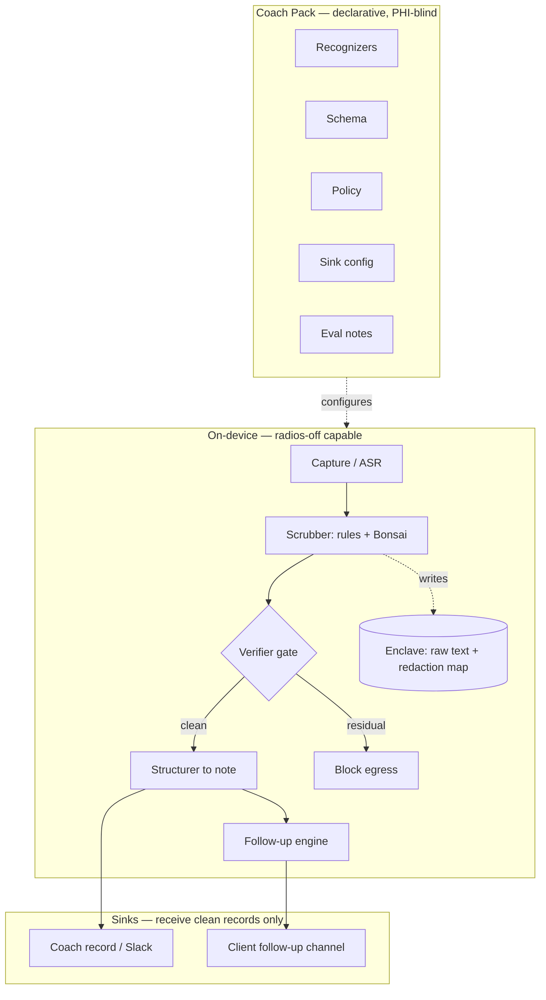
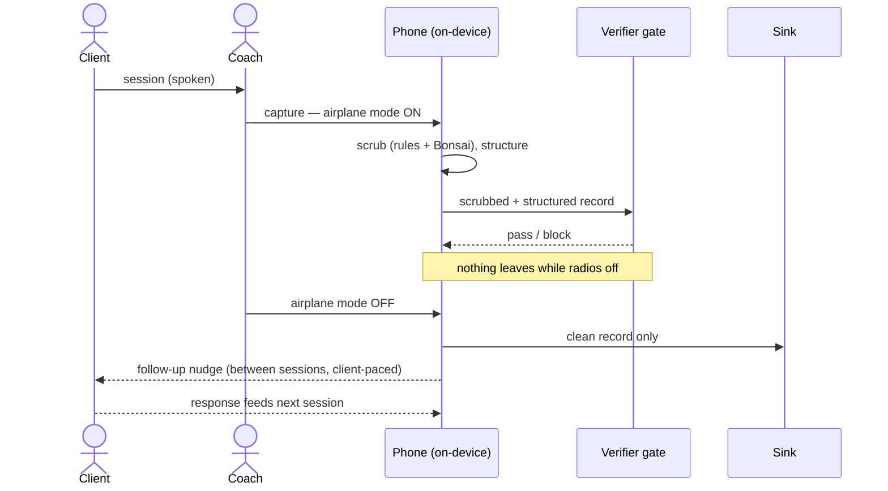
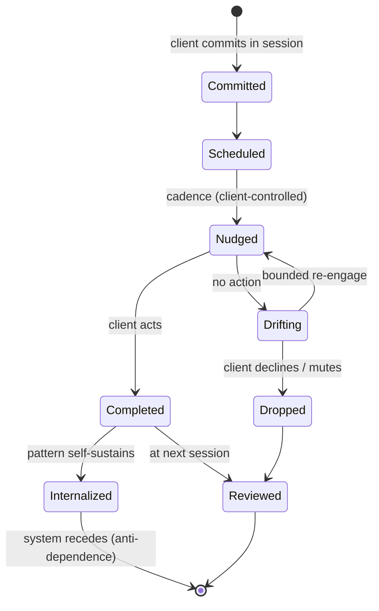
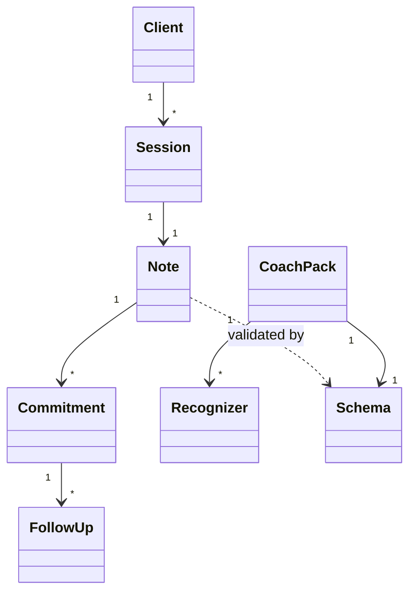

# Systems Characterization — The Coach's Note & Follow-Up System
### Meadows' 12 leverage points · systems archetypes · UML · prior art · what we ruled out
*The demo's domain, modeled as a system rather than an app. "A level above AI engineer" means intervening where leverage actually is.*

---

## 0. The reframe

The earlier domain was a clinical home visit. The new one: **a mental-health coach runs a client session, the system captures the note on-device, and drives effective follow-up between sessions.** Two shifts matter:

- **From note to loop.** The note is not the product. The *follow-up loop* — the thing that turns a session insight into sustained behavior change — is the product. The note is one stock inside that loop.
- **From clinician to coach.** A coach is generally not a HIPAA-covered entity. The incumbent privacy model (cloud + BAA + fast deletion) doesn't cleanly apply — which makes the on-device guarantee *more* compelling, not less, because there is no regulatory backstop. It also imposes a hard scope boundary (§6): a coach is not a therapist, and the system must not act like one.

---

## 1. Prior art — and the lane it leaves open

The behavioral-health AI scribe field is dense: **Mentalyc, Upheal, Eleos, Blueprint, S10.AI, AutoNotes, Supanote, Yung Sidekick, JotPsych, Twofold**, plus general scribes (**Abridge, Nuance DAX, Suki, Freed, DeepScribe, Nabla, Commure**) retrofitted for therapy.

Two patterns define the field, and both are openings:

1. **Privacy = deletion, not architecture.** The standard model is cloud processing with a BAA and fast audio deletion (Mentalyc ~3 days; Upheal deletes after note generation). S10.AI processes audio locally but still sits on cloud + SOC 2. **No incumbent has a radios-off, on-device, provable-no-egress guarantee.** That is our claim.
2. **Competition on the note, not the loop.** Differentiation is template breadth (SOAP/DAP/BIRP/GIRP), modality recognition, EHR integration. Follow-up and outcomes are thin — Eleos and Blueprint gesture at engagement/outcomes, nobody owns the between-session loop. **That is our wedge.**

The gap we occupy: *on-device privacy as the substrate, the follow-up loop as the product, the coach as the buyer.*

---

## 2. Decisions already ruled out (the rejected-options log)

Carried forward so we don't relitigate:

| Rejected | Why | Chose instead |
|---|---|---|
| Cloud inference on raw PHI | Breaks the trust boundary | On-device Bonsai |
| k8s / Nomad on the data path | Datacenter schedulers; nothing to schedule at the edge | No orchestrator on data path |
| Phones as orchestrated fleet nodes | iOS can't host a client; device isn't ours to schedule | Phones are app clients |
| Scrub-on-mini / LAN relay (Option B) | Makes the LAN a PHI transport | Scrub-on-phone; mini sees clean records only |
| Forking the core per clinic | Certification hazard, N diverging security cores | Declarative coach pack |
| Bonsai 8B on iPhone 11 | Memory budget (jetsam) | Bonsai 1.7B |
| Full Presidio Python stack on-device | Python doesn't run on iOS | Authoring (Presidio) / runtime (native) split |
| Cloud + BAA + fast-deletion privacy model | Incumbent model; weaker claim | Radios-off on-device |
| Competing on note-template breadth | Low-leverage incumbent game | Follow-up loop as product |
| Licensed-therapist market entry | Crowded; on-device thesis weaker where BAA exists | Coach market |
| Wizard-of-Oz demo / MITRE MIST de-id | Not real / training burden | Real scrub; Philter+Presidio rule packs |
| Build registry/fleet before the loop converts | Drawing the owl | Two-beat demo first |

---

## 3. The 12 leverage points (Meadows), mapped

Ordered least → most effective. The pattern to notice: **incumbents intervene at 12–8; our differentiation lives at 6, 4, 3, 2.**

| # | Leverage point | In this system | Where the leverage is |
|---|---|---|---|
| 12 | Numbers / parameters | Follow-up cadence, action-items per session, template fields, recall threshold | Low. Tuning weekly→biweekly barely moves outcomes. Where incumbents compete. |
| 11 | Buffers | Stocks of client trust, motivation, coach attention; backlog of open commitments | Slow, stabilizing. A growing un-actioned backlog is an early overload signal. |
| 10 | Stock-and-flow structure | The pipeline: session → note → commitments → follow-ups → response → next session | On-device vs. cloud is a stock-flow restructuring. Moderate, foundational. |
| 9 | **Delays** | Time between session insight and follow-up reinforcement | **High.** Shorten the insight→reinforcement delay and the behavior loop can actually stabilize. Software is the only thing that can compress it. The core of "effective follow-up." |
| 8 | Balancing feedback loops | Accountability nudges; outcome checks that detect drift and correct | High. Strong balancing loops keep clients on their stated goals. |
| 7 | Reinforcing feedback loops | Small win → self-efficacy → more action → more wins. **Also the dependence spiral.** | High and dangerous. Drive the *self-efficacy* loop; starve the *dependence* loop (§4). |
| 6 | **Information flows** | Who sees the raw disclosure. Ours: client's raw words stay on-device; coach gets structured insight; no third party ever sees it. | **Very high, cheap.** Our privacy architecture *is* an information-flow intervention, not a feature. |
| 5 | Rules | Egress rule (nothing sends until verifier passes); consent; pack contract; confidentiality as the substrate of honest disclosure | High. Whoever controls the rules controls the system. |
| 4 | Self-organization | The coach-pack ecosystem (anyone authors a pack, no central control); the client's own growing capacity to self-regulate | High. The system evolves without us; the client's autonomy is the goal-state. |
| 3 | **Goals** | Incumbent goal: produce audit-ready notes / reduce doc burden. Ours: sustained client transformation, with privacy as precondition. | **Very high.** Changing what the note is *for* reorients everything beneath it. This is the "level above AI engineer." |
| 2 | **Paradigm** | Incumbent: data must go to the cloud; privacy is a cost managed by deletion. Ours: intelligence comes to the data; privacy is the precondition for the honesty coaching needs to work at all. | **Highest practical.** Extraction → sovereignty. |
| 1 | Transcending paradigms | Hold the whole system lightly: the tech should know when to recede. The best outcome is the client no longer needing it. | The discipline of non-attachment to your own system. |

**The strategic read:** an AI engineer optimizes leverage point 12 (a better note template). The systems thinker moves 6, 3, and 2 — who sees the data, what the note is for, and the paradigm of where intelligence lives. We compete where incumbents structurally can't follow without abandoning their cloud model.

---

## 4. Systems archetypes (the traps to design against)

**Primary — Shifting the Burden to the Intervenor (the dependence/addiction trap).**
A follow-up system can quietly substitute its nudges for the client's own self-regulation. The symptomatic fix (app prompts) atrophies the fundamental capacity (self-direction), and the client comes to need the app to function. This is the central ethical and design tension. The countermeasure is structural: the follow-up lifecycle has an **autonomy exit** (§5 state diagram) — commitments that become self-sustaining graduate *out* of nudging, and the system measures its success partly by how often clients stop needing it. Build toward recession, not retention.

**Watchlist:**
- **Seeking the wrong goal.** Optimizing "follow-ups sent" or "notes generated" instead of client change → lots of activity, no transformation. The incumbent trap. Measure outcomes, not output.
- **Drift to low performance (eroding goals).** Follow-up quality silently degrades as "good enough" resets the bar. The eval harness holds the standard absolute, not relative to last month.
- **Success to the successful.** Routing follow-up energy to responsive clients starves the struggling ones who need it most, widening the gap. Watch attention allocation.
- **Fixes that fail / policy resistance.** Over-nudging provokes mute-and-disengage. The client must control the interrupt cadence (Constitution VIII applied to the client, not just the operator).

---

## 5. UML

### Component diagram

### Sequence diagram — session to follow-up

### State diagram — follow-up lifecycle (with the autonomy exit)

### Class diagram — domain model

---

## 6. The scope boundary (non-negotiable design rule)

A coach is not a therapist. The system must:
- **Stay in the coaching frame** — goals, commitments, behavior change. Not diagnosis, not treatment.
- **Detect and escalate clinical risk** — if session content indicates crisis or self-harm, the system's job is to surface human/professional escalation, never to handle it as a coaching follow-up or to nudge through it.
- **Never let follow-up automation simulate care.** A nudge is a reminder of the client's own commitment, not therapeutic intervention.

This is leverage point 5 (rules) enforcing the paradigm at leverage point 2: the tool serves the relationship and recedes; it does not impersonate the clinician it is careful not to be.

---

## 7. Where the demo sits

The two-beat "Airplane Mode" demo is the *visible cross-section* of this system:
- **Beat 1 (airplane-mode loop)** demonstrates leverage points **6** (information flows — raw words never leave) and **5** (the egress rule), made watchable.
- **Beat 2 (five-file reveal)** demonstrates leverage point **4** (self-organization — the ecosystem evolves the system without forking).

The follow-up loop (leverage points 9, 8, 7) is the *next* demo surface once the no-leak loop converts — and it is where the dependence archetype must be visibly designed against, or the system fails on its own terms.

---

## One-line characterization
> Incumbents optimize the note at low-leverage points inside a cloud paradigm; this system intervenes at information flows, goals, and paradigm — keeping the client's raw words on the device, aiming the loop at the client's autonomy, and designing the whole thing to recede as it succeeds.
