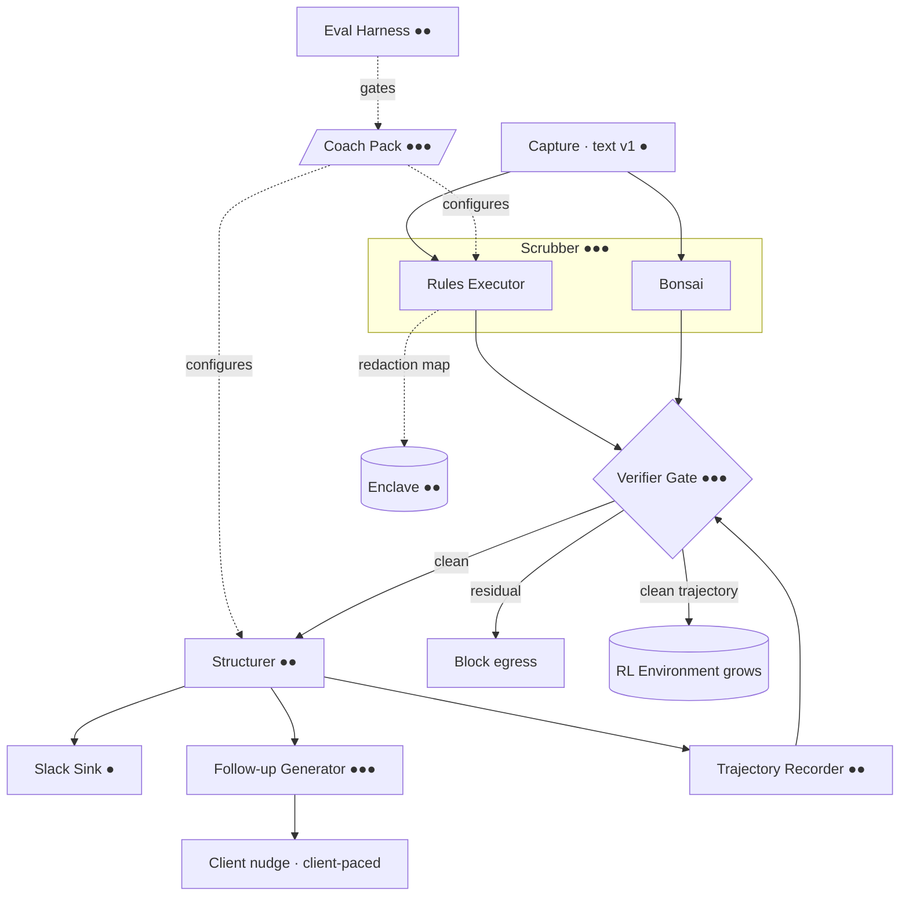
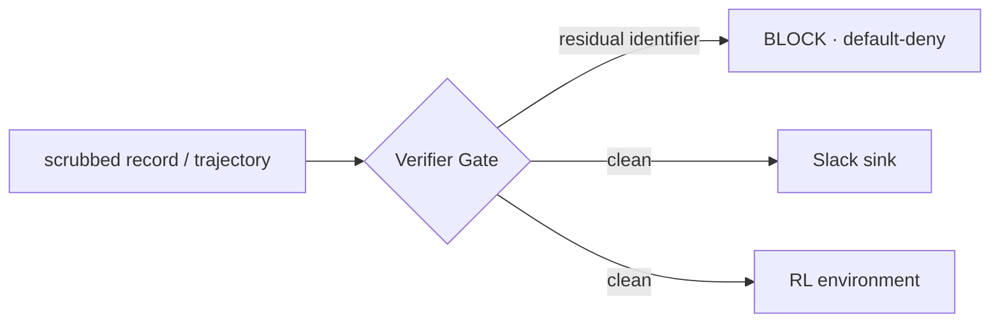

# Component Design — Airplane Mode
### Every component anchored to the constitution and to Meadows' leverage points
*Addresses the PRD (outcomes) and RFC-001 (ADRs). The throughline matrix is the centerpiece — and the anti-drift harness.*

---

## How to read this

Each component carries the same five anchors. If a component can't name all five, it doesn't belong.

- **Tier** — design effort: ●●● critical (real or the demo is a lie) · ●● medium (real but light) · ● thin (stub).
- **Constitution** — the article it embodies.
- **Meadows** — the leverage point it occupies (higher number = lower leverage; we cluster high/low-number).
- **Serves** — the PRD outcome, the RFC ADR, and the demo beat it powers.

The visual grammar is deliberate: the *loop* shows where a component sits in the flow, the *matrix* shows what it answers to, the *ladder* shows how much leverage it has.

---

## The loop



Note the single **Verifier Gate** guarding two exits — to Slack and to the environment. That dual duty is why it's the spine.



---

## The throughline matrix (centerpiece)

Every component on every framework axis at once. This is the harness against architectural drift.

| Component | Tier | Responsibility | Constitution | Meadows | Serves (PRD · RFC · Beat) |
|---|---|---|---|---|---|
| **Coach Pack + Golden Notes** | ●●● | The declarative contract + the hand-labeled truth set everything runs on | III, IX | **4** self-organization | all outcomes · ADR-005/011 · Beats 1–2 |
| **Rules Executor** | ●●● | Run the pack's recognizers (regex/context/checksum/lists) | IV, VI | **5** rules | outcome 1 · ADR-003/004 · Beats 1–2 |
| **Bonsai Scrubber** | ●●● | Catch contextual/narrative identifiers the rules miss | I | **6** information flows | outcome 1 · ADR-001/004 · Beat 1 |
| **Verifier Gate** | ●●● | Re-scan; block egress on any residual — to Slack *and* to the environment | II, IX | **5** + **6** | outcomes 1 & 3 · ADR-004/011 · Beats 1, 3 |
| **Follow-up Generator** | ●●● | A client-paced nudge built from the client's own commitment | VIII, X | **9** delays + **8** balancing | outcome 2 · ADR-009/012 · value beat |
| **Structurer** | ●● | Note → typed record (classify, then extract) | IV, V | **10** stock-flow | outcome 1 · ADR-004 · Beat 1 |
| **Enclave Store** | ●● | Hold raw input + redaction map on-device only | IX | **11** buffers + **6** | outcome 1 · ADR-001 · Beat 1 |
| **Trajectory Recorder** | ●● | Deposit a de-identified (s,a,r,s′) through the gate | X | **7** reinforcing | outcome 3 · ADR-011/012 · Beat 3 |
| **Eval Harness** | ●● | Recall gate / conformance; holds the standard absolute (anti-drift) | II, VI | **8** balancing | gate · ADR-005 · Beat 2 |
| **Capture** | ● | Text input (v1) | — | **10** stock-flow (entry) | — · — · Beat 1 |
| **Slack Sink** | ● | Render Block Kit; post the clean record | IV | **10** stock-flow (node) | outcome 1 · ADR-010 · Beat 1 |

---

## The Meadows ladder — where we intervene

High leverage at the top. The point from the systems characterization, made visual: **our design clusters and peaks where incumbents can't follow** (1–6), while their products sit at 10–12.

```
 1  Transcend paradigm   ◀ "design to recede" — the whole ethic
 2  Paradigm             ◀ intelligence comes to the data; privacy as precondition (the architecture)
 3  Goals                ◀ autonomy reward (ADR-012); the note serves growth, not compliance
 4  Self-organization    ◀ Coach Pack ecosystem — extend without forking
 5  Rules                ◀ Rules Executor · Verifier Gate egress rule · pack contract
 6  Information flows     ◀ on-device scrub · Bonsai · the gate (who sees what)
 ───────────────────────  our design effort concentrates above this line
 7  Reinforcing loops    ◀ Trajectory Recorder / RL environment (gain on the autonomy loop)
 8  Balancing loops      ◀ Eval Harness · follow-up accountability
 9  Delays               ◀ Follow-up Generator (shorten insight→reinforcement)
10  Stock-flow           ◀ Structurer · Capture · Sink
11  Buffers              ◀ Enclave (protected stock)
12  Parameters           ◀ cadence, thresholds (config) ── where incumbents compete
```

---

## Core component cards (the five we design)

Same grammar each: Responsibility · Contract · Internals · Anchors.

### 1. Coach Pack + Golden Notes ●●●
**Responsibility:** the declarative contract for a practice, plus the hand-labeled truth set the whole system is measured against.
**Contract:** five declarative files (`recognizers/ schema/ policy/ sink/ eval/`) + ~20 golden notes with expected redactions. PHI-blind; no executable code.
**Internals:** recognizers authored in Presidio off-device, exported to portable rule packs; golden notes are synthetic and hand-labeled (the "earn the map" output). The eval folder is both conformance gate and the seed of the trajectory/eval corpus.
**Anchors:** Constitution III, IX · Meadows 4 (self-organization) · PRD all · RFC ADR-005/011 · Beats 1–2.

### 2. Rules Executor ●●●
**Responsibility:** deterministically catch structured identifiers from the pack's definitions.
**Contract:** `text + rule_pack → spans[]`.
**Internals:** native Swift regex + context windows + checksum validators + deny/allow lists; consumes the compiled pack. No model — this is the negative-space stage (deterministic, auditable, fast).
**Anchors:** Constitution IV, VI · Meadows 5 (rules) · PRD 1 · RFC ADR-003/004 · Beats 1–2.

### 3. Bonsai Scrubber ●●●
**Responsibility:** catch contextual/narrative identifiers rules miss (names in odd positions, relationships, free-text places).
**Contract:** `text → spans[]`.
**Internals:** Bonsai 1.7B on-device via mlx-swift, prompted for de-identification; the ambiguous layer. Output unioned with the Rules Executor (redact if either flags).
**Anchors:** Constitution I (agent wrapped in verification, not oracle) · Meadows 6 (information flows) · PRD 1 · RFC ADR-001/004 · Beat 1.

### 4. Verifier Gate ●●● (the spine)
**Responsibility:** prove no identifier escapes — to any destination.
**Contract:** `record | trajectory → {pass → forward · residual → block}`.
**Internals:** re-scans the *output* against the full rule set; default-deny on any residual hit. Guards **two** egress points (Slack sink, RL environment) with one rule. Airplane mode makes it visible on stage; the gate is what enforces it always. This is the legal control (the MHMDA de-identification requirement) and the technical one at once.
**Anchors:** Constitution II, IX · Meadows 5 + 6 · PRD 1 & 3 · RFC ADR-004/011 · Beats 1, 3.

### 5. Follow-up Generator ●●●
**Responsibility:** turn a commitment into a genuinely useful, client-paced nudge — and never optimize for dependence.
**Contract:** `commitment + de-identified state → follow-up (timing, framing) | none`.
**Internals (v1):** heuristic/coach-authored from the client's own commitment text — no trained policy. The reward signal it logs is the **autonomy delta**, never engagement. Cadence is the client's to set (they control the interrupt). On any clinical-risk signal: surface human escalation, do not nudge.
**Anchors:** Constitution VIII, X · Meadows 9 (delays) + 8 (balancing) · PRD 2 · RFC ADR-009/012 · value beat.

---

## Build order (falls out of tier + dependency)

1. **Coach Pack + Golden Notes** — the spec for everything; nothing is testable without it.
2. **Rules Executor + Verifier Gate** — coupled, and the spine; the gate reuses the executor's rule set.
3. **Bonsai Scrubber** — unions into the gate; completes the scrub.
4. **Follow-up Generator** — the value proof; needs a structured record to act on.
5. **Trajectory Recorder + Eval Harness** — both ride the gate; thin once the gate exists.
6. **Thin shells** — Structurer (light), Slack Sink (post only), Capture (text), Enclave (simple store).

---

## One-line test
> Every component names its constitution article, its leverage point, and the PRD outcome and ADR it serves — the five we marked ●●● are real, the gate guards both exits, and the design's effort visibly concentrates at the high-leverage end of the ladder.
