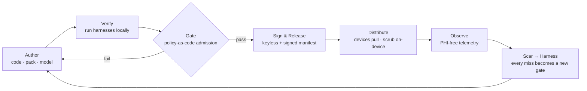

# The Harnessed Loop
### A delivery process where the ethical and legal framework *is* the set of gates
*Mitchell's harness engineering, applied one level up: every ethical, legal, and security requirement becomes an automated harness the loop cannot bypass. Ethics-as-code, law-as-code. Your k8s demo is the proof it's enforced, not professed.*

---

## The move

Mitchell's core idea: when an agent makes a mistake, you don't just fix it — you build a permanent harness so it can never make that mistake again, and the harness set compounds every session (Constitution VI). We apply that to ethics and law: **every requirement in the constitution and the legal framework is an automated check that gates the delivery loop.** A principle that can't be made into a harness stays prose — and prose is weak.

The framework doesn't live in a doc people are asked to honor. It lives in the gates they can't get past.

---

## The loop

Mitchell parallels, made literal:
- *"Give the agent a way to verify its work"* → every requirement has an automated verifier; nothing is hope-based.
- *"Every mistake → a permanent harness"* → every ethical/legal/security miss → a new gate; the gate set grows monotonically.
- *"Quality bar per surface"* → gate intensity per harness (hard-block vs. warn).
- *"Always have an agent running"* → the harnesses run on every change in CI.

---

## The harness matrix (the centerpiece)

Each harness encodes a requirement, gates the loop, and maps to a k8s "hard part" from the battletest — so your k8s demo lands one beat per harness.

| Harness | Encodes (constitution · law · ethic) | Checks | k8s hard part | In your k8s demo |
|---|---|---|---|---|
| **Recall gate** | MHMDA de-id (Safe Harbor) · Const. II | scrub recall ≥ threshold on golden notes | Smoke test (13) | run the eval Job → PASS |
| **Leakage gate** | No-leak · MHMDA · Const. IX (default-deny) | zero residual identifiers post-gate | Smoke test (13) + CNI egress (11) | feed a leaky pack → **BLOCKED** |
| **Pack-blindness** | Trust boundary · Const. IX | pack has no code, no PHI access, creds sourced not stored | RBAC / admission (08) | OPA/Kyverno rejects a non-conformant pack |
| **Reward lint** ★ | Anti-dependence ethic · ADR-012 · Const. X | reward references autonomy signals only; **no engagement terms** | *(no k8s analog — ours)* | reward with "engagement" → **BLOCKED** |
| **Scope-boundary** ★ | Coach ≠ therapist · wellbeing ethic | escalation path present; no clinical-claim language | *(no k8s analog — ours)* | pack missing escalation → **BLOCKED** |
| **Signature & provenance** | Supply-chain trust · Gap 1 | keyless-signed, Rekor entry, SLSA provenance | CA / TLS (04) | `cosign verify`; unsigned artifact rejected |
| **Manifest & revocation** | Version integrity · Gap 2 | signed monotonic version; not revoked | etcd / DNS (07/12) | bump manifest; revoke a version; device stops pulling |
| **OSCAL conformance** | MHMDA controls machine-checkable | mapped controls satisfied | encryption/control config (06) | conformance report → green |
| **PHI-free telemetry** | No backdoor + know your fleet · Gap 4 | telemetry = version/health only, no content | worker observability (09/10) | inspect payload → no content |

★ = **novel.** The two ethical harnesses have no k8s or CNCF analog. The legal and security harnesses reuse existing patterns (policy-as-code, cosign, OSCAL); the *ethical* ones are our genuine contribution — they're what "a level above" actually means.

---

## The k8s demo, as a walk through the gates

When you demo the k8s path, you're not showing infrastructure — you're showing the framework enforcing itself. A clean run order:

1. **Apply the policies** (OPA/Kyverno) — "these are the constitution and MHMDA, as admission control."
2. **Submit a good pack** → eval Job runs → recall/leakage gates PASS → signed → manifest bumped → distributed. "The loop shipped because it was safe."
3. **Submit a leaky pack** → leakage gate **blocks**. "The cluster refused to ship a leak."
4. **Submit a pack whose reward mentions engagement** → reward lint **blocks**. "It refused to ship a dependence engine." *(This is the beat no other system can show.)*
5. **Submit a pack with no escalation path** → scope-boundary **blocks**. "It refused to let a coach act like a therapist."
6. **Revoke a version** → devices stop pulling. "Bad artifacts get recalled."
7. **Show the telemetry payload** → version and health, no content. "We know the fleet is healthy without a backdoor into anyone's phone."

Every beat is a gate; every gate is a clause of the constitution or the law. The platform engineer watches principles execute.

---

## Scar → harness (the compounding)

The loop closes by converting incidents into gates. A leak found in the wild, a dependence pattern detected in telemetry, a re-identification near-miss — each becomes a new harness that runs forever after. The gate set only grows. This is Mitchell's "the harness compounds every session," applied to ethics and law: the system gets *more* principled with every scar, automatically.

---

## The honest edge — what stays prose (for now)

The loop is also a diagnostic: a principle that resists becoming a harness is a principle we can't yet enforce. Current prose-only items, named so we don't pretend otherwise:

- **Autonomy delta measurement** (RFC open-Q1) — until we have a concrete proxy, the reward lint can only check that no *engagement* term is present; it can't yet verify the reward *positively* tracks autonomy.
- **Trajectory re-identification floor** (RFC open-Q2 · Gap 3) — "de-identified" is gate-checkable; "safe to pool" is not yet.
- **"Is the follow-up actually good?"** — quality of the human moment resists automation; it stays human-reviewed.

These are the honest frontier. Everything above the line is enforced; these three are still vibes, and we say so.

---

## One-line test
> Pass every harness and you have honored the entire framework by construction; fail one and the loop will not ship; find a new way to fail and the loop grows a new gate — and when the cluster blocks a pack that rewards engagement, the audience sees an ethic execute as code.
