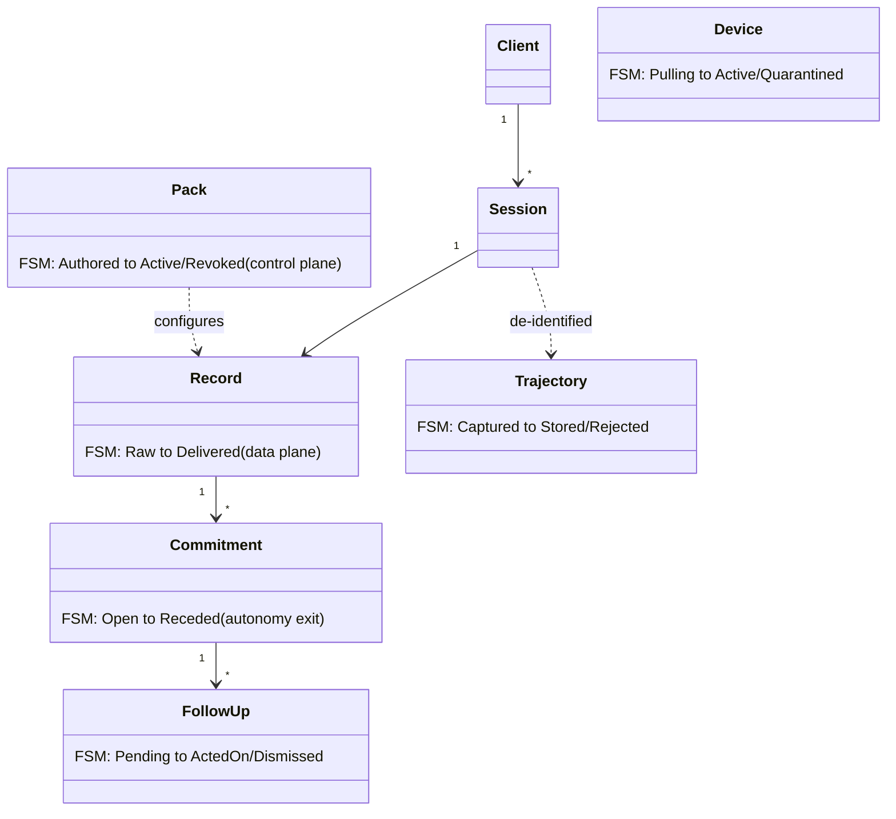
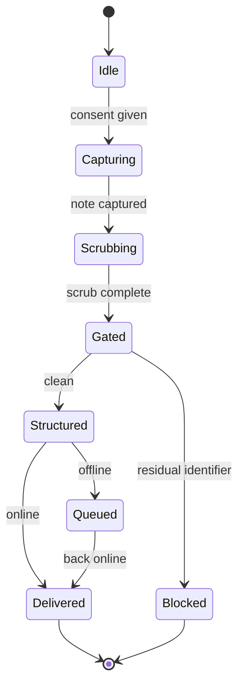
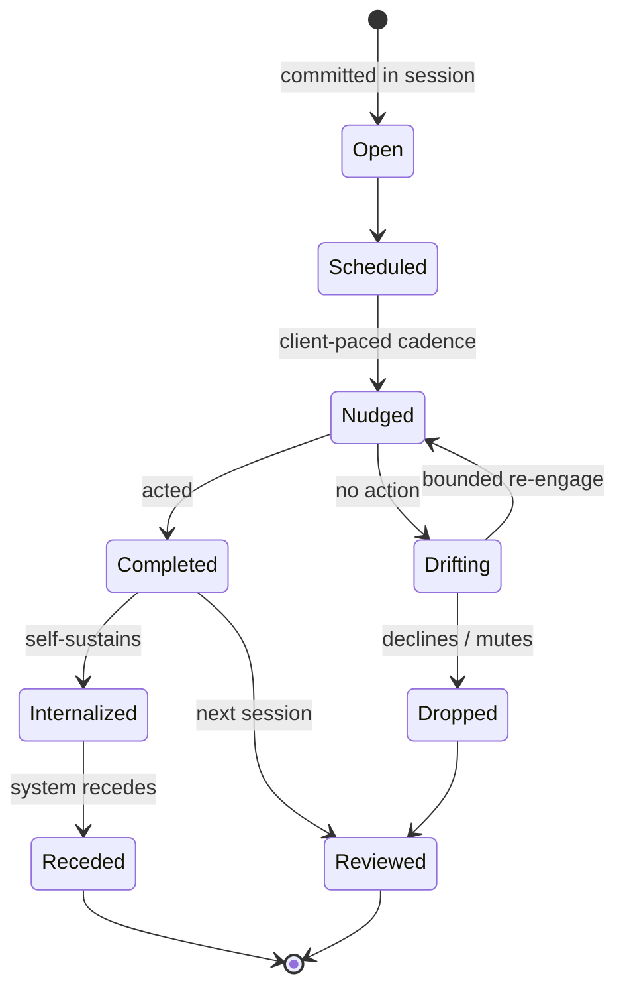
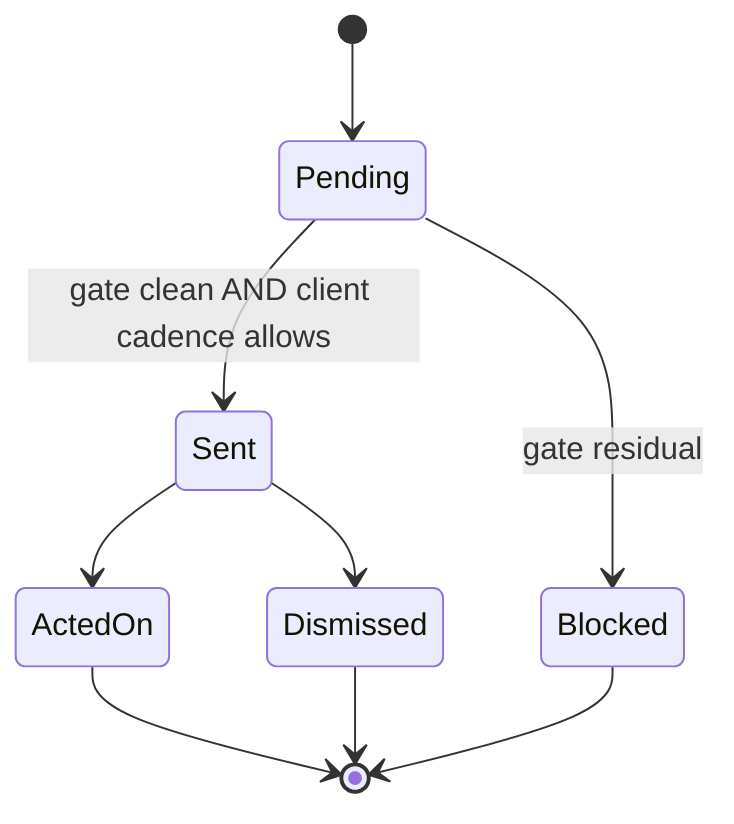
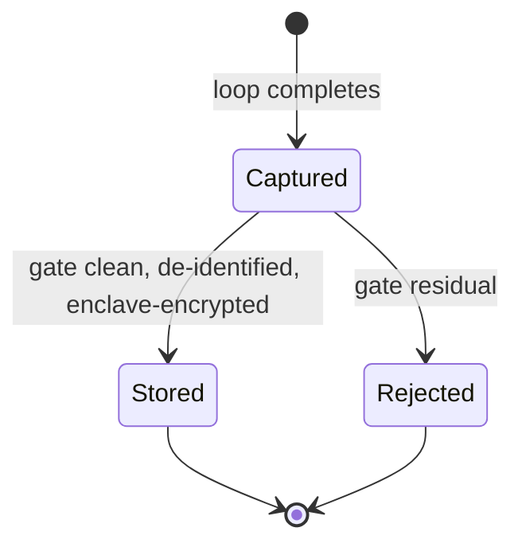
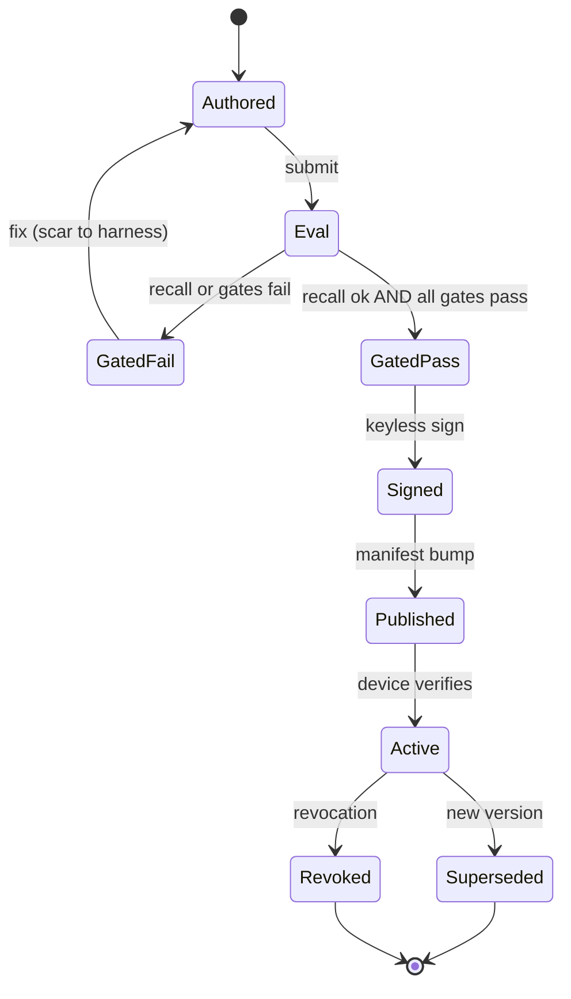
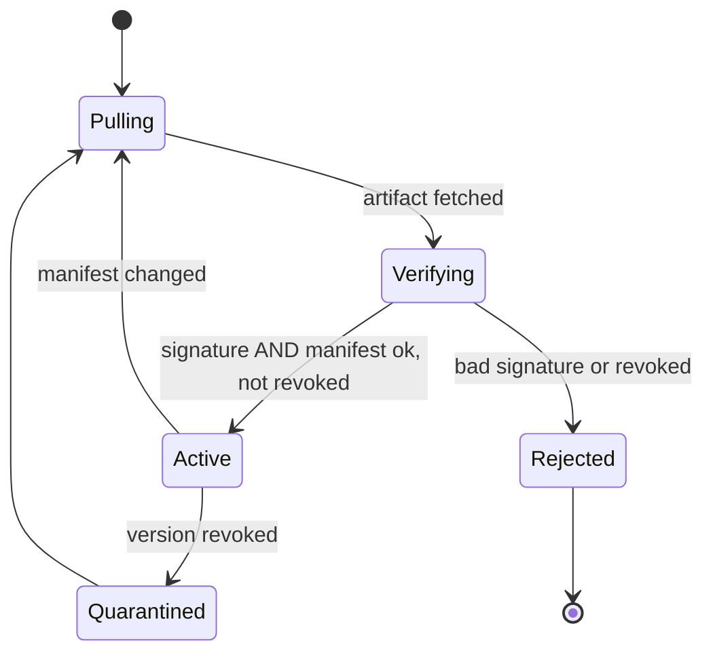
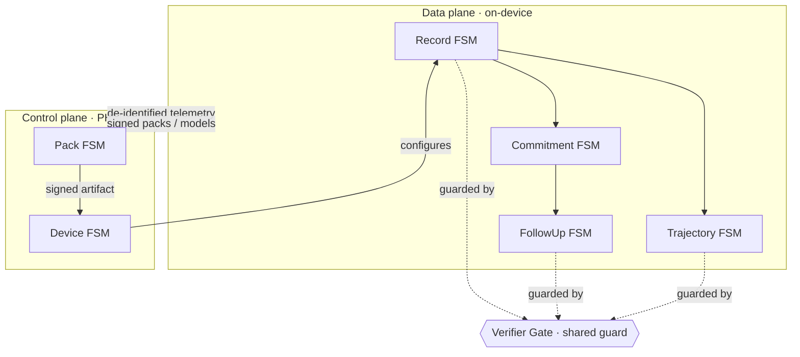

# State Machine System — Workload · Data Model · Control Planes
### One coordinated system of machines, not one swamp. Invariants as unreachable transitions.
*The formal backbone of the canon. Each stateful entity and plane gets its own machine; the verifier gate is the guard they share; the security/legal/ethical invariants become edges that do not exist.*

---

## The discipline

- **A system of small machines**, one per stateful entity and per plane — never one mega-machine (that's the over-modeling smell).
- **Invariants are unreachable transitions.** "Raw input never reaches the sink" isn't a rule we enforce — it's an edge the graph doesn't contain. Stronger than a check; it's a graph property (Constitution IX).
- **Shared guards** connect the machines: the verifier gate guards three of them; the eval+gates guard the Pack machine.
- **Goal states encode ethics.** The Commitment machine's terminal is `Receded`, not max-engagement — the anti-dependence ethic (ADR-012) as where the machine is *trying to go*.

---

## Data model (entities + their governing machine)

---

## Data-plane machines (on-device)

### Record — the workload (one session's journey)

There is **no edge** from `Capturing` or `Scrubbing` to `Delivered`/`Queued`. Every path out passes through `Gated`. The trust boundary is the graph's shape.

### Commitment — the autonomy exit (the ethical machine)

`Receded` is the goal terminal. There is **no** `MaximallyEngaged` state — the machine cannot pursue dependence because the graph offers no path to it.

### FollowUp

### Trajectory — RL-environment ingress

No edge from `Captured` to `Stored` that bypasses the gate. The RL environment can only ingest gate-clean trajectories.

---

## Control-plane machines (PHI-free)

### Pack — the harnessed delivery loop

No edge from `Authored` or `GatedFail` to `Signed`. **Nothing ships unverified.**

### Device — reconciliation

No edge from `Verifying` to `Active` without signature + manifest + revocation check. **Nothing runs unsigned.**

---

## Composition — the system and its boundary

Across the plane boundary: only **signed artifacts down** and **de-identified telemetry up**. PHI has no edge that crosses it.

---

## The invariants, as unreachable transitions (the formal payoff)

| Invariant | Encoded as | Machine |
|---|---|---|
| Raw input never reaches the sink | no `Scrubbing → Delivered` edge | Record |
| The RL environment never ingests PHI | no `Captured → Stored` bypassing gate | Trajectory |
| Nothing runs unsigned | no `Verifying → Active` without checks | Device |
| Nothing ships unverified | no `Eval → Signed` without GatedPass | Pack |
| The system cannot pursue dependence | no `MaximallyEngaged` state exists | Commitment |
| PHI never leaves the device | no PHI edge crosses the plane boundary | Composition |

Each is a property of the graph, not a runtime hope.

---

## Transition → test mapping (feeds the eval harness)

- **Every transition** becomes a test case (does the guard fire correctly?).
- **Every guard** becomes a harness (the gates from the harnessed loop).
- **Every unreachable edge** becomes an assertion (the test suite proves the edge cannot be taken).
- **Every terminal** becomes an acceptance check (`Delivered`, `Receded`, `Stored`, `Active`).

The FSM is not documentation beside the build — it generates the test plan.

---

## One-line test
> The whole system is six small machines sharing one gate; the trust boundary, the no-leak rule, the signing requirement, and the anti-dependence ethic are all edges the graph does not contain — and every edge it *does* contain is a test.
